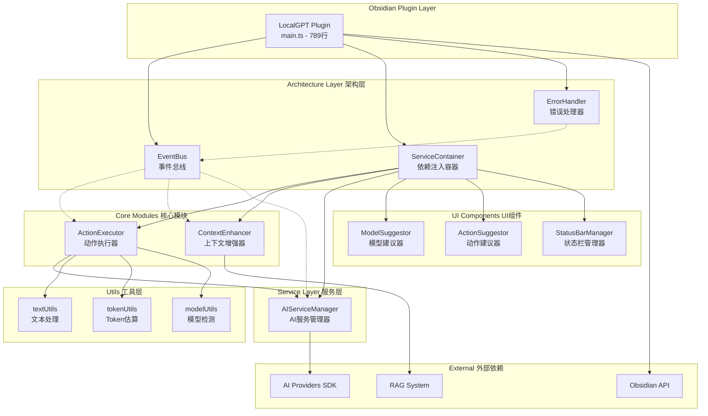
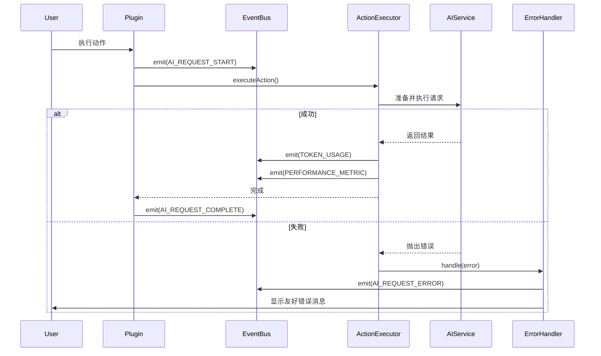
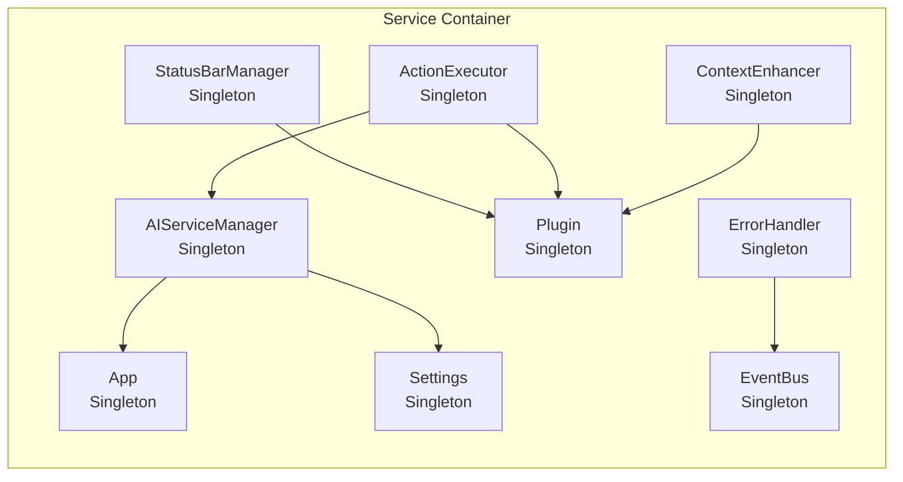

# LocalGPT 模块化架构图

## 整体架构

## 事件流

## 依赖注入结构

## 模块职责

### 架构层
- **EventBus**: 发布-订阅模式，解耦模块间通信
- **ServiceContainer**: 管理服务生命周期，处理依赖注入
- **ErrorHandler**: 统一错误处理，用户友好通知

### 核心模块
- **ActionExecutor**: 执行 AI 动作的完整流程
- **ContextEnhancer**: RAG 功能，增强上下文

### 服务层
- **AIServiceManager**: 管理 AI Provider 交互

### UI 组件
- **ModelSuggestor**: "@" 触发的模型选择
- **ActionSuggestor**: ":" 触发的动作选择
- **StatusBarManager**: 进度显示和状态管理

### 工具层
- **textUtils**: 文本处理和格式化
- **tokenUtils**: Token 使用估算
- **modelUtils**: 模型能力检测

## 代码统计

| 模块 | 文件数 | 代码行数 |
|------|--------|----------|
| 主文件 (main.ts) | 1 | 789 |
| 架构层 | 3 | ~900 |
| 核心模块 | 2 | ~740 |
| 服务层 | 1 | ~300 |
| UI 组件 | 3 | ~340 |
| 工具层 | 3 | ~180 |
| **总计** | **13** | **~3,249** |

## 重构成果

- **代码组织**: 从单一文件拆分为 13 个模块
- **main.ts 精简**: 从 1634 行减少到 789 行（减少 51.7%）
- **架构升级**: 从单体架构升级为模块化、事件驱动架构
- **可维护性**: 每个模块职责单一，易于理解和修改
- **可扩展性**: 通过事件和依赖注入，便于添加新功能 