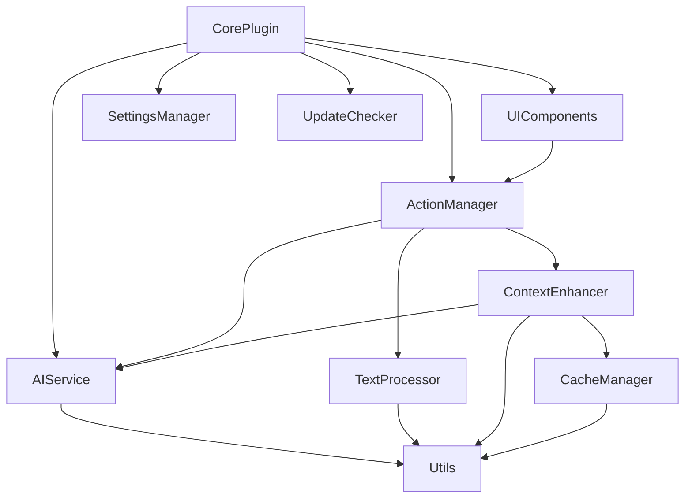

# LocalGPT 模块化拆分方案

## 一、代码结构分析

### 当前状态
当前 `main.ts` 文件包含了 1634 行代码，承担了过多职责。主要功能块包括：

1. **核心插件管理** - Obsidian 插件生命周期管理
2. **AI 服务集成** - 与 AI Providers SDK 的交互
3. **文本处理** - 选中文本处理、图片处理、Token 估算
4. **RAG 功能** - 向量存储、文档检索、上下文增强
5. **UI 组件** - 编辑器建议器、状态栏、进度条
6. **设置管理** - 配置加载、保存、数据迁移
7. **辅助功能** - 更新检查、文件缓存、标签管理

### 主要问题
- 单一文件承担过多职责，违反单一职责原则
- 类之间耦合度高，难以独立测试和维护
- 代码重用性差，相似功能重复实现

## 二、模块化拆分方案

### 1. **CorePlugin 模块**
**职责**：管理 Obsidian 插件的核心生命周期和协调各模块

**包含内容**：
- `LocalGPT` 主类（精简版）
- 插件生命周期方法：`onload()`, `onunload()`
- 模块注册和初始化
- 命令注册

**依赖**：所有其他模块

### 2. **AIService 模块**
**职责**：封装所有与 AI Provider 的交互逻辑

**包含内容**：
- `AIServiceManager` 类
  - `executeAIRequest()` - 执行 AI 请求
  - `getProvider()` - 获取合适的 Provider
  - `handleVisionProvider()` - 处理视觉模型切换
  - `monitorPerformance()` - 监控性能指标
- `TokenEstimator` 类
  - `estimateTokens()` - Token 估算
  - `estimateTokenUsage()` - 输入输出 Token 估算

**依赖**：`@obsidian-ai-providers/sdk`

### 3. **ActionManager 模块**
**职责**：管理和执行 AI 动作

**包含内容**：
- `ActionExecutor` 类
  - `runAction()` - 执行动作
  - `prepareActionPrompt()` - 准备动作提示词
- `ActionRegistry` 类
  - `registerAction()` - 注册动作
  - `getAction()` - 获取动作
  - `validateAction()` - 验证动作配置

**依赖**：`AIService`, `TextProcessor`, `ContextEnhancer`

### 4. **TextProcessor 模块**
**职责**：处理文本转换和格式化

**包含内容**：
- `TextProcessor` 类
  - `processText()` - 处理 AI 生成的文本
  - `removeThinkingTags()` - 移除思考标签
  - `formatOutput()` - 格式化输出
- `ImageProcessor` 类
  - `extractImageLinks()` - 提取图片链接
  - `convertToBase64()` - 转换图片为 Base64
  - `processImages()` - 批量处理图片

**依赖**：Obsidian API

### 5. **ContextEnhancer 模块（RAG）**
**职责**：实现检索增强生成功能

**包含内容**：
- `ContextEnhancer` 类
  - `enhanceWithContext()` - 增强上下文
  - `processLinkedFiles()` - 处理链接文件
- `VectorStoreManager` 类
  - `createVectorStore()` - 创建向量存储
  - `queryVectorStore()` - 查询向量存储
- `DocumentProcessor` 类
  - `processDocuments()` - 处理文档

**依赖**：`AIService`, `FileCache`

### 6. **UIComponents 模块**
**职责**：管理所有 UI 相关组件

**包含内容**：
- `ModelSuggestor` 类 - 模型选择建议器
- `ActionSuggestor` 类 - 动作选择建议器
- `StatusBarManager` 类
  - `initializeStatusBar()` - 初始化状态栏
  - `updateProgress()` - 更新进度
  - `animatePercentage()` - 动画显示
- `ContextMenu` 类
  - `showActionMenu()` - 显示动作菜单

**依赖**：Obsidian API, `ActionManager`

### 7. **SettingsManager 模块**
**职责**：管理插件设置和数据迁移

**包含内容**：
- `SettingsManager` 类
  - `loadSettings()` - 加载设置
  - `saveSettings()` - 保存设置
  - `migrateSettings()` - 设置迁移
- `DataMigrator` 类
  - `migrateV1ToV2()` - 版本迁移方法
  - `validateSettings()` - 验证设置

**依赖**：Obsidian API

### 8. **CacheManager 模块**
**职责**：管理文件缓存和标签缓存

**包含内容**：
- `FileCacheManager` 类
  - `initCache()` - 初始化缓存
  - `getFromCache()` - 获取缓存
  - `updateCache()` - 更新缓存
- `TagCacheManager` 类
  - `refreshTagCache()` - 刷新标签缓存
  - `getAllTagStats()` - 获取标签统计
  - `clearTagCache()` - 清除缓存

**依赖**：IndexedDB API, Obsidian API

### 9. **UpdateChecker 模块**
**职责**：检查插件更新

**包含内容**：
- `UpdateChecker` 类
  - `checkUpdates()` - 检查更新
  - `scheduleUpdateCheck()` - 定时检查
  - `notifyUpdate()` - 通知更新

**依赖**：Obsidian API

### 10. **Utils 模块**
**职责**：提供通用工具函数

**包含内容**：
- `PromptUtils` - 提示词处理工具
- `FileUtils` - 文件操作工具
- `ModelCapabilityDetector` - 模型能力检测
- `Logger` - 日志工具

**依赖**：无（基础工具模块）

## 三、模块依赖关系



## 四、接口设计建议

### 1. 事件驱动架构
使用事件发射器模式解耦模块间通信：
```typescript
interface IEventBus {
    emit(event: string, data: any): void;
    on(event: string, handler: Function): void;
    off(event: string, handler: Function): void;
}
```

### 2. 依赖注入
使用依赖注入容器管理模块依赖：
```typescript
interface IServiceContainer {
    register<T>(token: string, instance: T): void;
    get<T>(token: string): T;
}
```

### 3. 统一的错误处理
```typescript
interface IErrorHandler {
    handle(error: Error, context?: string): void;
    notify(message: string, type: 'error' | 'warning' | 'info'): void;
}
```

## 五、重构步骤建议

1. **第一阶段**：提取工具类
   - 创建 Utils 模块
   - 迁移通用工具函数

2. **第二阶段**：分离 UI 组件
   - 提取 ModelSuggestor 和 ActionSuggestor
   - 创建 StatusBarManager

3. **第三阶段**：抽象 AI 服务
   - 创建 AIService 模块
   - 封装 AI Provider 交互

4. **第四阶段**：模块化核心功能
   - 分离 ActionManager
   - 分离 TextProcessor
   - 分离 ContextEnhancer

5. **第五阶段**：优化架构
   - 实现事件总线
   - 添加依赖注入
   - 统一错误处理

## 六、预期收益

1. **可维护性提升**
   - 每个模块职责单一，易于理解和修改
   - 降低代码耦合度

2. **可测试性增强**
   - 模块可独立测试
   - 便于编写单元测试

3. **可扩展性改善**
   - 新功能可作为独立模块添加
   - 便于团队协作开发

4. **性能优化**
   - 按需加载模块
   - 减少内存占用

## 七、注意事项

1. **向后兼容**：确保重构不影响现有功能
2. **渐进式重构**：分阶段进行，每个阶段都要保证功能完整
3. **充分测试**：每个模块都需要完整的测试覆盖
4. **文档更新**：及时更新相关文档和注释 