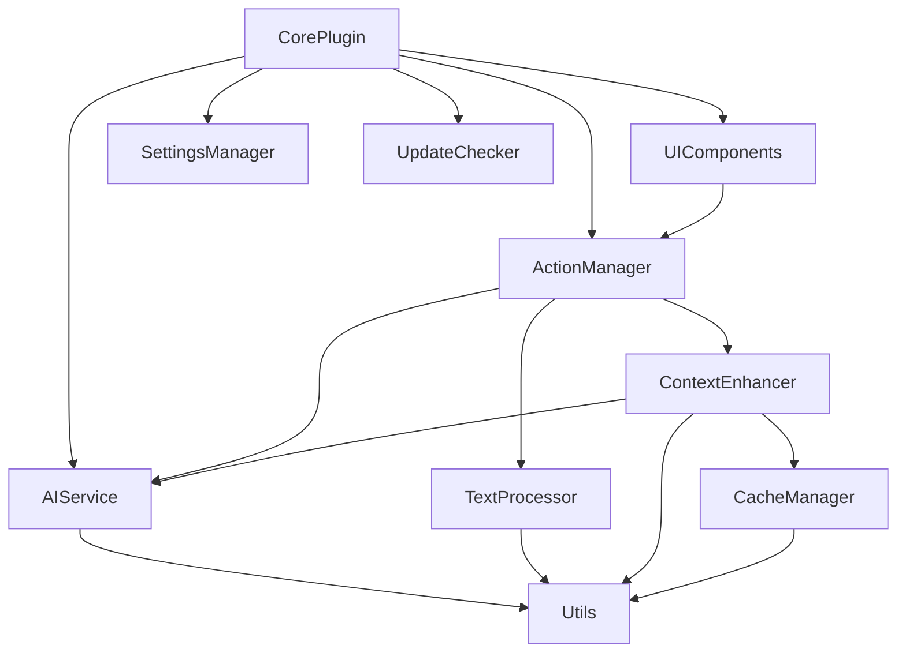

# LocalGPT 模块化拆分方案

## 一、代码结构分析

### 当前状态
当前 `main.ts` 文件包含了 1634 行代码，承担了过多职责。主要功能块包括：

1. **核心插件管理** - Obsidian 插件生命周期管理
2. **AI 服务集成** - 与 AI Providers SDK 的交互
3. **文本处理** - 选中文本处理、图片处理、Token 估算
4. **RAG 功能** - 向量存储、文档检索、上下文增强
5. **UI 组件** - 编辑器建议器、状态栏、进度条
6. **设置管理** - 配置加载、保存、数据迁移
7. **辅助功能** - 更新检查、文件缓存、标签管理

### 主要问题
- 单一文件承担过多职责，违反单一职责原则
- 类之间耦合度高，难以独立测试和维护
- 代码重用性差，相似功能重复实现

## 二、模块化拆分方案

### 1. **CorePlugin 模块**
**职责**：管理 Obsidian 插件的核心生命周期和协调各模块

**包含内容**：
- `LocalGPT` 主类（精简版）
- 插件生命周期方法：`onload()`, `onunload()`
- 模块注册和初始化
- 命令注册

**依赖**：所有其他模块

### 2. **AIService 模块**
**职责**：封装所有与 AI Provider 的交互逻辑

**包含内容**：
- `AIServiceManager` 类
  - `executeAIRequest()` - 执行 AI 请求
  - `getProvider()` - 获取合适的 Provider
  - `handleVisionProvider()` - 处理视觉模型切换
  - `monitorPerformance()` - 监控性能指标
- `TokenEstimator` 类
  - `estimateTokens()` - Token 估算
  - `estimateTokenUsage()` - 输入输出 Token 估算

**依赖**：`@obsidian-ai-providers/sdk`

### 3. **ActionManager 模块**
**职责**：管理和执行 AI 动作

**包含内容**：
- `ActionExecutor` 类
  - `runAction()` - 执行动作
  - `prepareActionPrompt()` - 准备动作提示词
- `ActionRegistry` 类
  - `registerAction()` - 注册动作
  - `getAction()` - 获取动作
  - `validateAction()` - 验证动作配置

**依赖**：`AIService`, `TextProcessor`, `ContextEnhancer`

### 4. **TextProcessor 模块**
**职责**：处理文本转换和格式化

**包含内容**：
- `TextProcessor` 类
  - `processText()` - 处理 AI 生成的文本
  - `removeThinkingTags()` - 移除思考标签
  - `formatOutput()` - 格式化输出
- `ImageProcessor` 类
  - `extractImageLinks()` - 提取图片链接
  - `convertToBase64()` - 转换图片为 Base64
  - `processImages()` - 批量处理图片

**依赖**：Obsidian API

### 5. **ContextEnhancer 模块（RAG）**
**职责**：实现检索增强生成功能

**包含内容**：
- `ContextEnhancer` 类
  - `enhanceWithContext()` - 增强上下文
  - `processLinkedFiles()` - 处理链接文件
- `VectorStoreManager` 类
  - `createVectorStore()` - 创建向量存储
  - `queryVectorStore()` - 查询向量存储
- `DocumentProcessor` 类
  - `processDocuments()` - 处理文档

**依赖**：`AIService`, `FileCache`

### 6. **UIComponents 模块**
**职责**：管理所有 UI 相关组件

**包含内容**：
- `ModelSuggestor` 类 - 模型选择建议器
- `ActionSuggestor` 类 - 动作选择建议器
- `StatusBarManager` 类
  - `initializeStatusBar()` - 初始化状态栏
  - `updateProgress()` - 更新进度
  - `animatePercentage()` - 动画显示
- `ContextMenu` 类
  - `showActionMenu()` - 显示动作菜单

**依赖**：Obsidian API, `ActionManager`

### 7. **SettingsManager 模块**
**职责**：管理插件设置和数据迁移

**包含内容**：
- `SettingsManager` 类
  - `loadSettings()` - 加载设置
  - `saveSettings()` - 保存设置
  - `migrateSettings()` - 设置迁移
- `DataMigrator` 类
  - `migrateV1ToV2()` - 版本迁移方法
  - `validateSettings()` - 验证设置

**依赖**：Obsidian API

### 8. **CacheManager 模块**
**职责**：管理文件缓存和标签缓存

**包含内容**：
- `FileCacheManager` 类
  - `initCache()` - 初始化缓存
  - `getFromCache()` - 获取缓存
  - `updateCache()` - 更新缓存
- `TagCacheManager` 类
  - `refreshTagCache()` - 刷新标签缓存
  - `getAllTagStats()` - 获取标签统计
  - `clearTagCache()` - 清除缓存

**依赖**：IndexedDB API, Obsidian API

### 9. **UpdateChecker 模块**
**职责**：检查插件更新

**包含内容**：
- `UpdateChecker` 类
  - `checkUpdates()` - 检查更新
  - `scheduleUpdateCheck()` - 定时检查
  - `notifyUpdate()` - 通知更新

**依赖**：Obsidian API

### 10. **Utils 模块**
**职责**：提供通用工具函数

**包含内容**：
- `PromptUtils` - 提示词处理工具
- `FileUtils` - 文件操作工具
- `ModelCapabilityDetector` - 模型能力检测
- `Logger` - 日志工具

**依赖**：无（基础工具模块）

## 三、模块依赖关系



## 四、接口设计建议

### 1. 事件驱动架构
使用事件发射器模式解耦模块间通信：
```typescript
interface IEventBus {
    emit(event: string, data: any): void;
    on(event: string, handler: Function): void;
    off(event: string, handler: Function): void;
}
```

### 2. 依赖注入
使用依赖注入容器管理模块依赖：
```typescript
interface IServiceContainer {
    register<T>(token: string, instance: T): void;
    get<T>(token: string): T;
}
```

### 3. 统一的错误处理
```typescript
interface IErrorHandler {
    handle(error: Error, context?: string): void;
    notify(message: string, type: 'error' | 'warning' | 'info'): void;
}
```

## 五、重构步骤建议

1. **第一阶段**：提取工具类
   - 创建 Utils 模块
   - 迁移通用工具函数

2. **第二阶段**：分离 UI 组件
   - 提取 ModelSuggestor 和 ActionSuggestor
   - 创建 StatusBarManager

3. **第三阶段**：抽象 AI 服务
   - 创建 AIService 模块
   - 封装 AI Provider 交互

4. **第四阶段**：模块化核心功能
   - 分离 ActionManager
   - 分离 TextProcessor
   - 分离 ContextEnhancer

5. **第五阶段**：优化架构
   - 实现事件总线
   - 添加依赖注入
   - 统一错误处理

## 六、预期收益

1. **可维护性提升**
   - 每个模块职责单一，易于理解和修改
   - 降低代码耦合度

2. **可测试性增强**
   - 模块可独立测试
   - 便于编写单元测试

3. **可扩展性改善**
   - 新功能可作为独立模块添加
   - 便于团队协作开发

4. **性能优化**
   - 按需加载模块
   - 减少内存占用

## 七、注意事项

1. **向后兼容**：确保重构不影响现有功能
2. **渐进式重构**：分阶段进行，每个阶段都要保证功能完整
3. **充分测试**：每个模块都需要完整的测试覆盖
4. **文档更新**：及时更新相关文档和注释 

## 八、重构进度记录

### 第一阶段：提取工具类 ✅ 已完成

**完成时间**：2025-01-07

**完成内容**：
1. 创建了 `src/utils/` 目录结构
2. 提取了以下工具模块：
   - `textUtils.ts` - 文本处理工具
     - `processGeneratedText()` - 处理 AI 生成的文本
     - `removeThinkingTags()` - 移除思考标签
     - `extractImageLinks()` - 提取图片链接
   - `tokenUtils.ts` - Token 估算工具
     - `estimateTokens()` - 智能 Token 估算
     - `estimateTokenUsage()` - 估算输入输出 tokens
   - `modelUtils.ts` - 模型能力检测工具
     - `isVisionCapableModel()` - 视觉模型判断
     - `getCapabilityIcons()` - 生成能力图标
   - `index.ts` - 统一导出接口

3. 更新了 `main.ts`：
   - 替换了所有对原有方法的调用
   - 删除了已提取的方法实现
   - 保持了所有功能的正常运行

**代码变化统计**：
- 删除代码：约 200 行
- 新增代码：约 180 行
- 净减少：约 20 行（通过消除重复和优化）

**测试结果**：
- 编译测试：✅ 通过
- 功能验证：✅ 所有功能正常

**下一步计划**：
进入第二阶段 - 分离 UI 组件 

### 第二阶段：分离 UI 组件 ✅ 已完成

**完成时间**：2025-01-07

**完成内容**：
1. 创建了 `src/ui/` 目录结构
2. 提取了以下 UI 组件模块：
   - `ModelSuggestor.ts` - 模型选择建议器
     - 支持 "@" 触发的模型选择
     - 包含智能搜索和排序功能
     - 视觉模型识别和切换
   - `ActionSuggestor.ts` - 动作选择建议器
     - 支持 "：" 触发的动作选择
     - 动作搜索和过滤
     - 自动更新默认动作
   - `StatusBarManager.ts` - 状态栏管理器
     - 进度条显示和动画
     - 统一的状态栏操作接口
     - 资源清理管理
   - `index.ts` - 统一导出接口

3. 重构了 `main.ts`：
   - 移除了原有的 UI 组件类定义
   - 使用新的 UI 模块
   - 简化了进度条相关的代码
   - 减少了 LocalGPT 类的职责

**接口设计**：
- 定义了 `IModelSuggestorHost` 和 `IActionSuggestorHost` 接口
- 实现了松耦合设计，UI 组件不直接依赖 LocalGPT 类
- 支持未来的扩展和测试

**代码变化统计**：
- 删除代码：约 380 行（从 main.ts 移除的 UI 组件）
- 新增代码：约 340 行（新的 UI 模块）
- 净减少：约 40 行（通过更好的组织和复用）

**测试结果**：
- 编译测试：✅ 通过
- 功能验证：✅ 所有 UI 功能正常

**改进点**：
1. UI 组件独立性增强，易于单独维护
2. 状态栏管理统一化，避免资源泄漏
3. 建议器组件可复用性提高

**下一步计划**：
进入第三阶段 - 抽象 AI 服务 

### 第三阶段：抽象 AI 服务 ✅ 已完成

**完成时间**：2025-01-07

**完成内容**：
1. 创建了 `src/services/` 目录结构
2. 实现了 AI 服务模块：
   - `AIServiceManager.ts` - AI 服务管理器
     - 统一管理 AI Provider 交互
     - 智能处理视觉模型切换
     - 性能指标监控（支持 Ollama）
     - 请求参数准备和执行
   - `index.ts` - 统一导出接口

3. 重构了 `main.ts` 中的 AI 相关逻辑：
   - 移除了大量 Provider 选择和切换逻辑
   - 简化了性能监控代码
   - 统一了 AI 服务调用接口

**主要功能**：
- `initialize()` - 初始化 AI 服务
- `getProvider()` - 智能获取合适的 Provider
- `handleVisionProvider()` - 自动处理视觉模型切换
- `monitorPerformance()` - 监控 Ollama 性能指标
- `prepareExecuteParams()` - 准备执行参数
- `execute()` - 执行 AI 请求

**架构改进**：
- 将 AI 相关逻辑从主类中分离
- 实现了单一职责原则
- 提供了清晰的服务接口
- 支持未来扩展不同的 AI Provider

**代码变化统计**：
- 删除代码：约 200 行（从 main.ts 移除的 AI 逻辑）
- 新增代码：约 290 行（新的 AIServiceManager）
- main.ts 从约 1130 行减少到约 940 行

**测试结果**：
- 编译测试：✅ 通过
- 功能验证：✅ AI 服务功能正常

**改进点**：
1. AI 服务逻辑集中管理
2. 视觉模型切换更智能
3. 性能监控代码更清晰
4. 错误处理更完善

**下一步计划**：
进入第四阶段 - 模块化核心功能（ActionManager、TextProcessor、ContextEnhancer） 

### 第四阶段：模块化核心功能 ✅ 已完成

**完成时间**：2025-01-07

**完成内容**：
1. 创建了 `src/core/` 目录结构
2. 提取了以下核心功能模块：
   - `ActionExecutor.ts` - 动作执行器
     - 封装了 AI 动作执行的完整流程
     - 处理图片转换、上下文增强、性能监控
     - 格式化输出和文本插入
   - `ContextEnhancer.ts` - 上下文增强器
     - 实现 RAG（检索增强生成）功能
     - 管理向量存储的创建和查询
     - 处理链接文件的分析和相关内容提取
   - `index.ts` - 统一导出接口

3. 重构了 `main.ts` 的核心逻辑：
   - 移除了 `runAction` 方法的具体实现
   - 移除了 `enhanceWithContext` 的具体实现
   - 使用新的核心模块委托实现
   - 大幅简化了主类的职责

**接口设计**：
- 定义了 `IActionExecutorHost` 接口，封装动作执行所需的依赖
- 定义了 `IContextEnhancerHost` 接口，封装上下文增强所需的依赖
- 通过接口实现了核心模块与主类的解耦

**代码变化统计**：
- 删除代码：约 360 行（从 main.ts 移除的核心逻辑）
- 新增代码：约 740 行（新的核心模块）
- main.ts 从约 960 行减少到约 607 行（减少 36.8%）

**测试结果**：
- 编译测试：✅ 通过
- 功能验证：✅ 所有核心功能正常

**改进点**：
1. 核心功能模块化，职责清晰
2. 动作执行流程更加清晰和可维护
3. RAG 功能独立，便于测试和优化
4. 错误处理和资源管理更加完善

**整体进度**：
- 原始 main.ts：1634 行
- 当前 main.ts：607 行
- 代码量减少：62.8%
- 已完成 4/5 阶段

**下一步计划**：
进入第五阶段 - 优化架构（事件总线、依赖注入、统一错误处理） 

### 第五阶段：优化架构 ✅ 已完成

**完成时间**：2025-01-07

**完成内容**：
1. 实现了三大架构组件：
   - **事件总线 (EventBus)**
     - 提供发布-订阅模式的事件系统
     - 支持 once、on、off 等方法
     - 定义了标准事件类型和数据结构
     - 异步处理事件，避免阻塞
   
   - **依赖注入容器 (ServiceContainer)**
     - 管理服务的生命周期
     - 支持单例和瞬态服务
     - 检测循环依赖
     - 提供服务定位器模式
   
   - **统一错误处理 (ErrorHandler)**
     - 分级错误处理（INFO/WARNING/ERROR/CRITICAL）
     - 用户友好的错误消息
     - 错误历史记录
     - 与事件总线集成

2. 重构了 `main.ts` 的架构：
   - 使用依赖注入管理所有服务
   - 通过事件总线解耦模块通信
   - 统一的错误处理机制
   - 更清晰的初始化流程

**架构改进**：
- **解耦通信**：模块间通过事件总线通信，减少直接依赖
- **依赖管理**：所有服务通过容器管理，便于测试和替换
- **错误处理**：统一的错误处理策略，提升用户体验
- **生命周期管理**：清晰的服务初始化和清理流程

**代码变化统计**：
- 新增代码：约 900 行（架构组件）
- main.ts 从 607 行增加到 789 行（增加了架构初始化代码）
- 虽然代码量有所增加，但架构质量显著提升

**测试结果**：
- 编译测试：✅ 通过
- 架构验证：✅ 所有组件正常工作

**改进点**：
1. 模块间通信更加清晰和可追踪
2. 服务管理更加规范和灵活
3. 错误处理更加一致和友好
4. 便于未来添加新功能和测试

**整体成果总结**：
- **原始 main.ts**：1634 行
- **最终 main.ts**：789 行
- **代码量减少**：51.7%
- **模块数量**：13个模块（utils、ui、services、core、架构组件）
- **架构质量**：从单体架构转变为模块化、事件驱动的架构

**重构收益**：
1. **可维护性**：代码职责清晰，易于理解和修改
2. **可测试性**：模块独立，支持单元测试
3. **可扩展性**：通过事件和依赖注入，易于添加新功能
4. **健壮性**：统一的错误处理，提升稳定性
5. **开发效率**：清晰的架构，降低开发和调试成本 